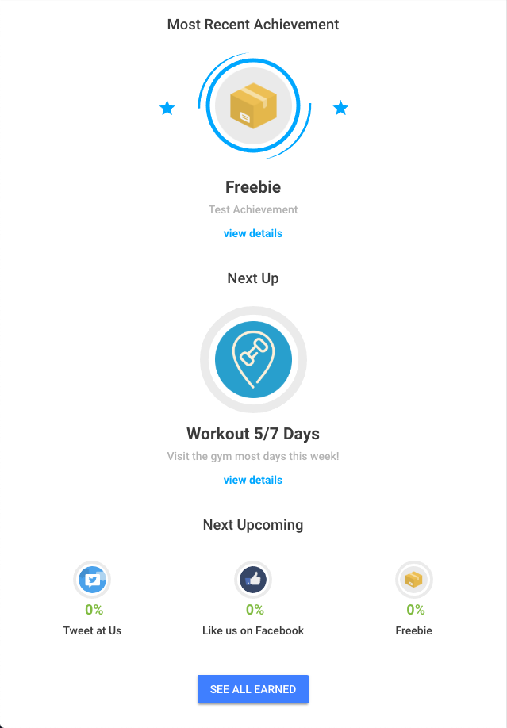
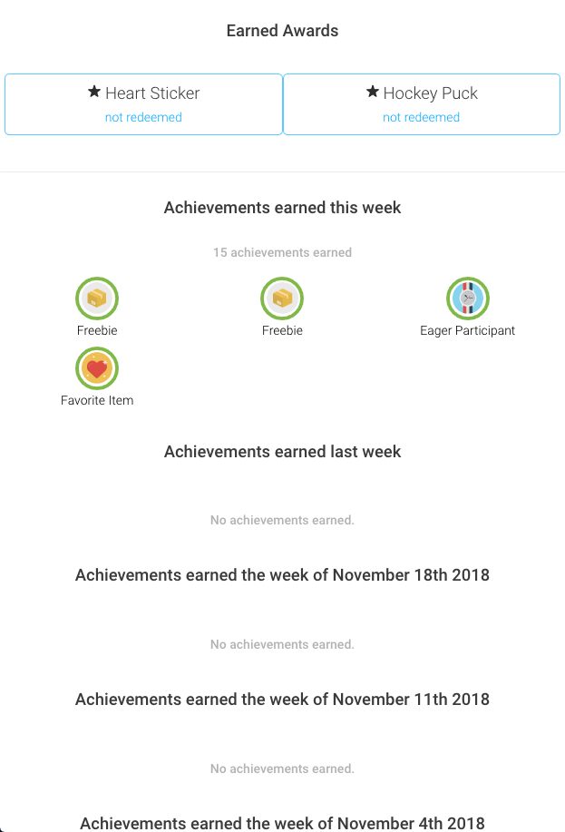
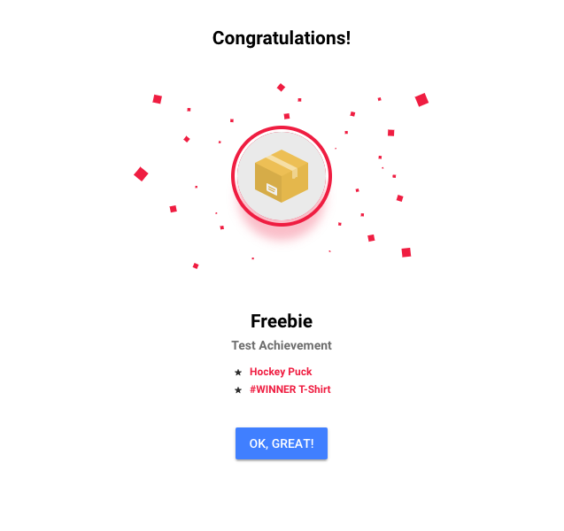

# BadgeUp Ionic Client
Official Ionic client for working with [BadgeUp](https://www.badgeup.io/). This client supports Ionic 3 running Angular 6. Angular 5 is not supported.

[](https://travis-ci.org/BadgeUp/badgeup-ionic-client)

## Quickstart

```sh
npm install @badgeup/badgeup-ionic-client --save
```

## Polyfills
If you plan to use this client with old browsers, you will likely need to polyfill:
* [Fetch](https://developer.mozilla.org/en-US/docs/Web/API/Fetch_API)
* [URLSearchParams](https://developer.mozilla.org/en-US/docs/Web/API/URLSearchParams)

## API Keys
You will need to configure an API key with the following scopes:

`achievement:read`, `award:read`, `criterion:read`, `earnedachievement:read`, `earnedaward:read`, `event:create`, `metric:read`, `progress:read`

## Initialization
Generate an API key for your application from [BadgeUp dashboard](https://dashboard.badgeup.io/) with the permissions listed above, and configure `@badgeup\badgeup-ionic-client` by adding the BadgeUp Ionic module to the imports in `app.module.ts`.

```js
import {BadgeUpModule} from '@badgeup/badgeup-ionic-client';

@NgModule({
  ...

  imports: [
    ...
    BadgeUpModule.forRoot({apiKey: 'YOUR API KEY HERE'}),
    ...
  ],

  ...
})
```

Once the module has been registered, inject the service in the root component and configure the subject provider.
Here is an example of the root component that demonstrates how to configure the subject provider, emit events, and subscribe to new achievements:

```js
import { Component, OnDestroy, OnInit } from '@angular/core';
import { Platform } from 'ionic-angular';
import { StatusBar } from '@ionic-native/status-bar';
import { SplashScreen } from '@ionic-native/splash-screen';

import {BadgeUpClient, BadgeUpEvent, BadgeUpEarnedAchievement, BadgeUpNotificationType} from '@badgeup/badgeup-ionic-client';

import { HomePage } from '../pages/home/home';
@Component({
  templateUrl: 'app.html'
})
export class MyApp implements OnDestroy {
  rootPage:any = HomePage;
  badgeUpClient: BadgeUpClient;

  constructor(platform: Platform, statusBar: StatusBar, splashScreen: SplashScreen, badgeUpClient: BadgeUpClient) {
    platform.ready().then(() => {
      statusBar.styleDefault();
      splashScreen.hide();
    });

    badgeUpClient.setSubject('mark'); // in production this would be some sort of ID or UUID

    badgeUpClient.subscribe(this.badgeUpNotificationCallback);
    badgeUpClient.emit({
      key: "user:action"
    });
  }

  ngOnDestroy() {
    this.badgeUpClient.unsubscribe(this.badgeUpNotificationCallback);
  }

  badgeUpNotificationCallback(notificationType: BadgeUpNotificationType, data: any) {
    if(notificationType === BadgeUpNotificationType.NewAchievementEarned) {
      let ea = <BadgeUpEarnedAchievement>data;
      alert("You earned a new achievement! " + ea.achievement.name);
    }
  }
}
```

:warning: Don't forget to unsubscribe in `ngOnDestroy()` as not doing that will cause a memory leak.

## About this Repo
This repository contains a minimal demo application and the module that is published to npm.

The module codebase can be found in [src/shared/modules/badgeup-client](src/shared/modules/badgeup-client).

## Components

### Overview
The overview component contains three main components - most recent achievement, next up, and up to three upcoming achievements. Depending on the section, 'view details' may be clicked on and will expand with criteria and award details.

#### Example: Overview Page as a Page

```html
<ion-content>
  <overview></overview>

  <div col-12 class="all-earned">
    <button ion-button (click)="goToAllEarnedComponent()">See All Earned</button>
  </div>
</ion-content>
```



### All Earned
Displays unredeemed, earned awards and earned achievements by date.

#### Example: Opening Earned Component as a Modal

```js
import { Component } from '@angular/core';
import { ModalController } from 'ionic-angular';

import { AllEarnedComponent } from '@badgeup/badgeup-ionic-client';

@Component({
  selector: 'page-earned',
  templateUrl: 'earned.html'
})
export class EarnedPage {
  constructor(private modalCtrl: ModalController) { }

  public open() {
    const modalPage = this.modalCtrl.create(AllEarnedComponent);
    modalPage.present();
  }
}
```



### Earned Achievement Popup
This component is provided as part of the module but is not intended to be directly invoked by developers. The module will usually handle invoking this popup directly.



## Directives

##### badgeup-click-event
If you want to send events to BadgeUp when a user clicks a button, add a `badgeup-click-event` directive that has an event key as value.
For example, if you want to track list refreshes as event key "list:refresh", you would use the following code:

```html
<button badgeUpClickEvent="list:refresh">Refresh the list</button>
```

You can also easily pass data using the badgeUpClickEventData attribute:

```html
<button badgeUpClickEvent="list:refresh"
        badgeUpClickEventData="{foo: true}">Refresh the list</button>
```

You can also provide your own event modifier. The following code would decrement the value by one when you click 'Refresh the list'.
```html
<button badgeUpClickEvent="list:refresh"
        badgeUpClickEventModifier="@dec"
        badgeUpClickEventModifierValue="1">Refresh the list</button>
```

If you'd like to pass dynamic data to any of the attributes, you'd have to use property binding syntax. Just add square brackets:
```html
<button badgeUpClickEvent="list:refresh"
        [badgeUpClickEventData]="{userRank: getUserRank()}">
        Refresh the list
</button>
```

## Accessing the Underlying JS Client

You may want to interact with more of the APIs than the Ionic client currently exposes as a high-level interface.
You can access the underlying [JS client](https://github.com/badgeup/badgeup-browser-client) from the client:

```ts
const client = this.badgeUpClient.badgeUpJSClient;
const achievements = await client.achievements.getAll();
```
